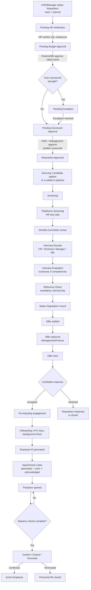
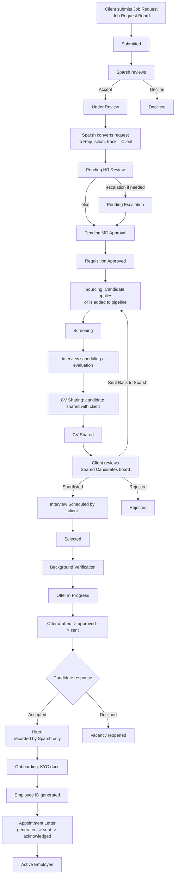

# Sparsh Magic HRMS — Hiring Workflows Guide

A user guide and step-by-step testing reference for the two recruitment tracks the system
supports: **Internal Hiring** (Sparsh Magic hiring for itself) and **Client Hiring** (Sparsh
Magic recruiting on behalf of a client company). Both tracks share the same core pipeline
screens (Candidates → Screening → Assessments → Interviews → Offers → Appointments →
Onboarding); what differs is the approval chain before sourcing starts and what happens
around the offer.

Screen names below match the actual navigation labels in **HRMS → Internal hiring** /
**HRMS → Client hiring** (workspace tab strip) so a tester can follow this document directly
against the running app.

---

## 1. Internal Hiring

Sparsh Magic hiring for its own roles. The defining feature: **the budget is Sparsh's own
money**, so the chain adds a mandatory budget gate and ends on a position scorecard instead
of a single sign-off.

### 1.1 Flowchart

### 1.2 Step-by-step test script

| # | Actor | Screen (HRMS → Internal hiring) | Action | Expected result |
|---|-------|----------------------------------|--------|------------------|
| 1 | HOD | Requisitions (Internal) | Create requisition, track = Internal | Status = **Pending HR Verification** |
| 2 | HR | Requisitions (Internal) | Verify role/headcount | Status = **Pending Budget Approval** |
| 3 | Finance/MD | Requisitions (Internal) | Approve with salary band | If within sanctioned strength → **Pending Scorecard Approval**; else → **Pending Escalation** |
| 4 | Management | Requisitions (Internal) | Resolve escalation (if raised) | Status advances to **Pending Scorecard Approval** |
| 5 | HR | Scorecard Library / Evaluation | Draft position scorecard | Scorecard awaits HOD approval |
| 6 | HOD, then Management (if managerial+) | Scorecard Evaluation | Approve scorecard | Requisition status = **Approved** |
| 7 | Recruiter | Candidate Pipeline | Add/import candidate against the requisition | Candidate appears at **Applied** stage |
| 8 | Recruiter | Screening Board | Screen candidate | Candidate moves to next allowed stage |
| 9 | HR | Telephonic Board | Record phone screen | Gate clears for interview scheduling |
| 10 | HR | Shortlist Committee | Record committee decision | Candidate cleared for interview |
| 11 | Recruiter | Interview Board | Schedule HR/Technical/Manager/MD rounds | Interview appears on the schedule |
| 12 | Interview panel | Interview Board | Submit evaluation scorecard (6 competencies) | Recommendation recorded; MD round gated to MD only |
| 13 | HR | Reference Check Board | Record reference check outcome | Required before offer for internal track |
| 14 | HR | Negotiation Board | Record agreed salary | Negotiation entry saved |
| 15 | HR | Offer Board | Draft offer (designation, CTC, DOJ) | Offer = **Draft** |
| 16 | Management/Finance | Offer Board | Approve offer | Offer = **Approved** |
| 17 | HR | Offer Board | Send offer | Offer = **Sent** (frozen); candidate link generated |
| 18 | Candidate (public link) | `/offer/:code` | Accept with typed signature | Offer = **Accepted**; candidate stage = Offer Accepted |
| 19 | HR | Pre-boarding Board | Track engagement touchpoints | Informational only — not a gate |
| 20 | Candidate (public link) | `/onboard/:code` | Submit KYC + documents (PAN or Aadhaar) | Onboarding checklist updates |
| 21 | HR | Onboarding Board | Verify documents, background check | Blockers clear one by one |
| 22 | HR | Onboarding Board | Generate Employee ID | Candidate becomes an **Active Employee**; employee code issued |
| 23 | HR | Appointments | Generate → send appointment letter | Candidate stage = Appointment Letter Sent |
| 24 | Candidate (public link) | `/appointment/:code` | Acknowledge | Letter = **Acknowledged** |
| 25 | Employee | Employee Profile (self) | Open **Job** tab | Appointment Letter card visible with View/Print |
| 26 | HR | Probation Board | Open probation record | Shows Overdue/Due-soon per policy |
| 27 | HR | Probation Board | Confirm / Extend / Terminate | Employee status updates; confirmation stamps candidate record |

---

## 2. Client Hiring

Sparsh Magic recruiting on behalf of a client company. The defining feature: **a client owns
the budget and the final hiring decision**, so a CV is shared outward and Sparsh waits on an
external verdict rather than approving internally.

### 2.1 Flowchart

### 2.2 Step-by-step test script

| # | Actor | Screen | Action | Expected result |
|---|-------|--------|--------|------------------|
| 1 | Client user | Job Requests (client's own view) | Submit a job request | Status = **Submitted** |
| 2 | Sparsh HR | Job Requests (HRMS → Client hiring) | Review request | Accept → **Under Review**; Decline → **Declined** |
| 3 | Sparsh HR | Job Requests | Convert to requisition | New requisition created, track = **Client**, linked to the client company |
| 4 | HR | Requisitions | (automatic) | Status = **Pending HR Review** |
| 5 | HR | Requisitions | Forward / escalate if needed | **Pending Escalation** → resolved → **Pending MD Approval** |
| 6 | MD | Requisitions | Approve | Status = **Approved**, vacancy open |
| 7 | Recruiter | Candidate Pipeline | Add/import candidate | Candidate at **Applied** stage |
| 8 | Recruiter | Screening Board | Screen candidate | Candidate advances |
| 9 | Recruiter | Interview Board | Schedule + evaluate | Interview outcome recorded (no mandatory reference check on this track) |
| 10 | HR | CV Sharing Board | Share candidate with the client | Status = **CV Shared**; client can now see this candidate |
| 11 | Client user | Shared Candidates (client's own board) | Review shared candidate | Client-restricted status vocabulary — no "Hired" option visible to client |
| 12 | Client user | Shared Candidates | Move to **Shortlisted** / **Interview Scheduled**, or **Send Back to Sparsh** / **Reject** | Status updates; "Sent Back" returns candidate to Sparsh's pipeline, distinct from Reject |
| 13 | Client user | Shared Candidates | Mark **Selected** | Status = **Selected** |
| 14 | Sparsh HR | Background Check Board | Run verification | Status = **Offer in Progress** once cleared |
| 15 | HR | Offer Board | Draft → approve → send offer | Offer = **Sent**; candidate link generated |
| 16 | Candidate (public link) | `/offer/:code` | Accept with signature | Offer = **Accepted** |
| 17 | Sparsh HR | CV Sharing Board | Mark **Hired** | Recorded — this is a Sparsh-only commercial fact, never set by the client |
| 18 | Candidate (public link) | `/onboard/:code` | Submit KYC documents | Onboarding checklist updates |
| 19 | HR | Onboarding Board | Verify documents, generate Employee ID | Candidate becomes an **Active Employee** |
| 20 | HR | Appointments | Generate → send → candidate acknowledges | Appointment Letter = **Acknowledged** |
| 21 | Employee | Employee Profile (self) | Open **Job** tab | Appointment Letter downloadable |

### 2.3 What distinguishes the two tracks (for testers)

| Aspect | Internal | Client |
|---|---|---|
| Budget owner | Sparsh Magic itself | The client company |
| Approval chain | HR Verify → **Budget Approval** → [Escalation] → **Scorecard Approval** | HR Review → [Escalation] → **MD Approval** |
| Position scorecard | Required | Not used |
| Reference check | Mandatory before offer | Not required |
| Salary negotiation record | Recorded internally | N/A (client negotiates its own terms) |
| Candidate visibility | Internal panel only | Shared outward via CV Sharing; client sees a curated, read-only view |
| Who marks "Hired" | N/A (candidate simply proceeds) | Sparsh only — never the client |
| Probation | Tracked (Probation Board) | Not tracked by Sparsh (client's own employee) |

---

## 3. Notes for testers on the newly added features (this pass)

These aren't part of the hiring flow itself but affect the **post-hire** screens a tester
will pass through in steps 25 / 21 above and elsewhere in Employee 360:

- **Appointment Letter self-service** — after appointment acknowledgement, log in as the
  employee and confirm the letter shows on their own Employee Profile → Job tab (not only on
  the HR-side Appointments board).
- **GMP tab** — on Employee Profile, HR can add/edit a Group Mediclaim enrolment (insurer,
  policy number, dependants); the employee can view their own read-only.
- **PSC document category** — Document Types now offers "PSC" alongside
  Identity/Statutory/etc. when uploading employee documents.
- **HR Policy Library** — every employee has a new **HR Policy Library** sidebar entry
  separate from HR's admin-only **Policy Register**; policies HR marks "acknowledgement
  required" show a pending banner until the employee acknowledges.
- **Payslip** — once a payroll run is Calculated/Locked, an employee can open
  **Payroll → My Payslip**, pick a period, and print/save it; HR can view the same document
  for any employee via **Payroll Runs → (row) → Payslip**; HR configures the header/footer
  under **Payroll → Payslip Template**.
- **Attendance → Late Coming** — a new tab shows a calendar highlighting late-arrival dates,
  plus by-department and by-employee breakdowns for the selected month.
- **Policy acknowledgement** — a weekly background job reminds employees who still owe a
  required acknowledgement (and HR, as a rollup); **HR Policy Register** now shows a
  company-wide "acknowledgement completion" dashboard.
- **Employee 360°** — the read-only `/hrms/employees/:id/360` view (not just the edit-mode
  Profile screen) now shows the Appointment Letter and GMP sections too.
